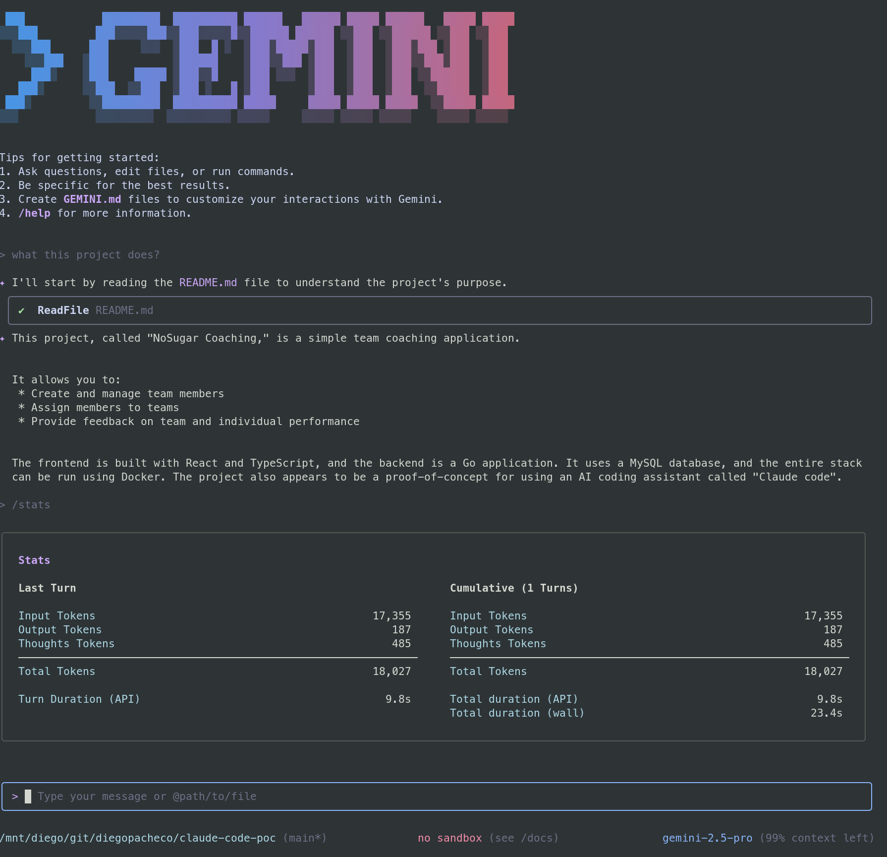
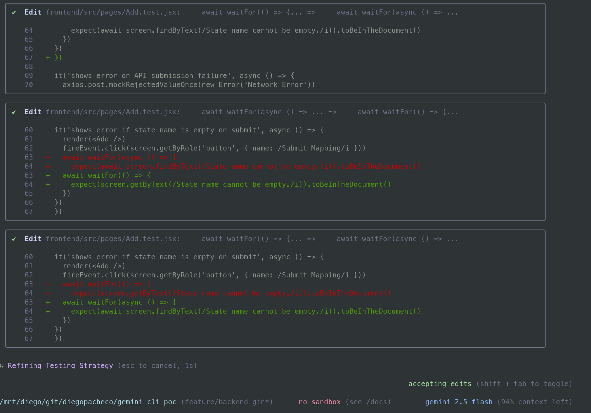
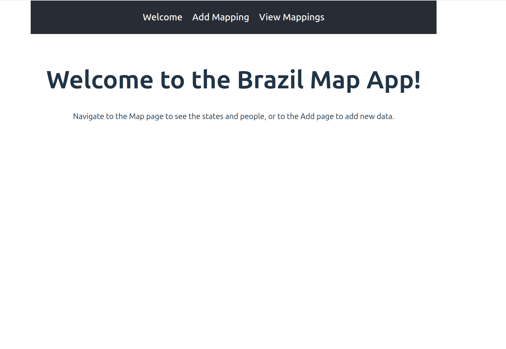
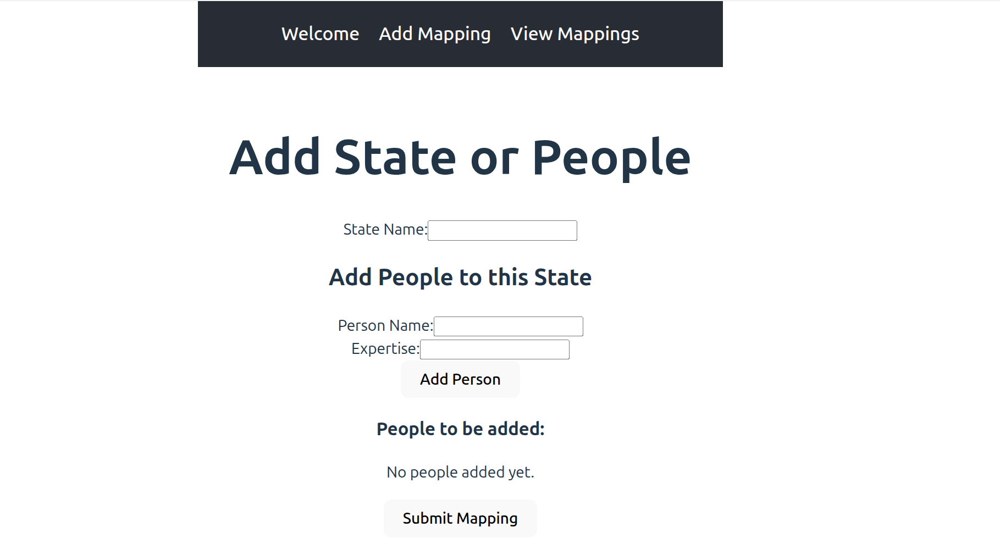
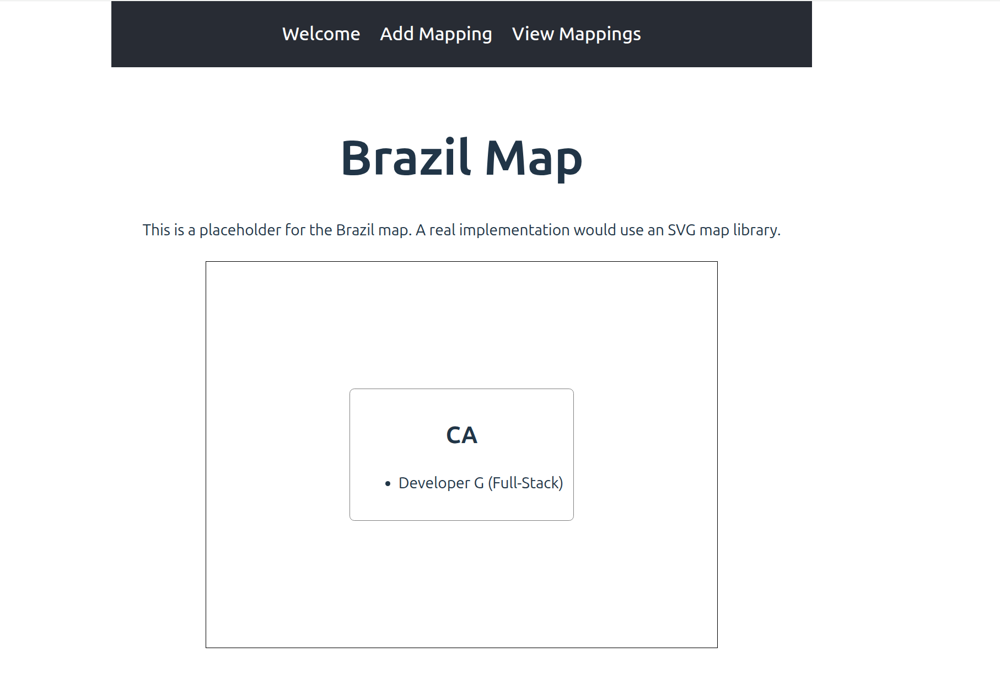

# gemini-cli-poc

gemini-cli-poc: Google Gemini-CLI poc with Gemini code agent on terminal.

Model: Gemini-2.5-flash

### Results

Gemini-cli in action  

Gemini-CLI trying to debug tests and fix them  

Result APP: Welcome  

Result APP: Add  

Result APP: Map  

### Stack

* Frontend: React,Vite and NodeJS 24
* Backend: Go, Gin, MySQL
* Database: MySQL 8x

### Development Experience

PROS
* Copy of claude code
* It's works-ish
* It's fast
* It's free
* I love the /stats command (which tell you how many tokens you used)

CONS
* gemini-2.5-flash is not as good as sonnet 4.0
* It got stuck for almost 1h to make a frontend test pass - I had to stop and fix it manually
* It generated bugs on the frontend, I had to fix them manually
* I asked for a MAP and I got a list of items, not a map

### Related POCs

* Anthropic Claude POC https://github.com/diegopacheco/claude-code-poc
* OpenAI Codex POC https://github.com/diegopacheco/codex-poc
* Google Jules https://github.com/diegopacheco/google-jules-poc
* Cursor POC https://github.com/diegopacheco/docker-cleanup
